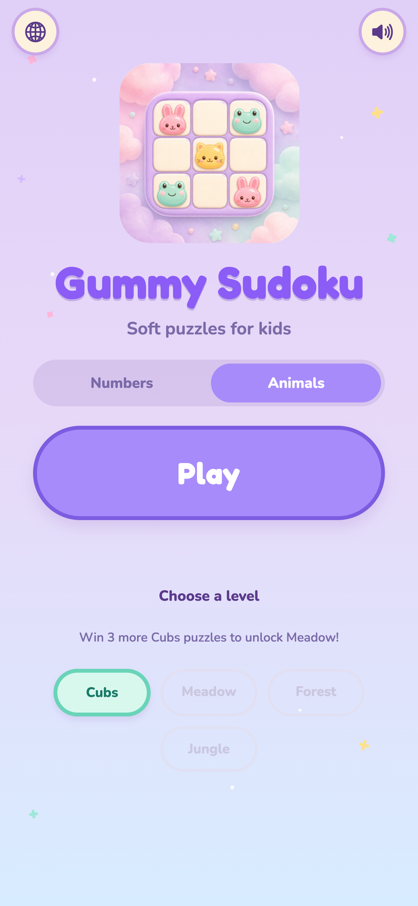
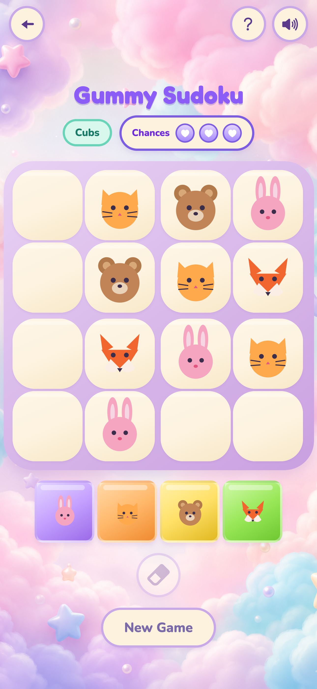

# Gummy Sudoku

Soft, candy-themed Sudoku for kids and families — built with [Expo](https://expo.dev) (SDK 57) and React Native.

Bright pastel boards, gentle feedback, and two playful modes turn classic logic puzzles into something approachable from the first tap. Runs on **iOS**, **Android**, and the **web**.

<p align="center">
  
  &nbsp;
  
  &nbsp;
  
  &nbsp;
  
</p>

## About the game

Gummy Sudoku is a kid-friendly puzzle app with a gummy/candy look: soft gradients, rounded cells, and calm audio. Progress unlocks as you win, mistakes stay gentle (three chances), and nothing requires an account.

### Two ways to play

| Mode | What it is | Ladder |
| --- | --- | --- |
| **Animals** | Cute animal glyphs instead of digits — great for younger players | 4×4 **Cubs → Meadow**, then 6×6 **Forest → Jungle** |
| **Numbers** | Classic Sudoku with digits | 9×9 **Easy → Medium → Hard → Expert → Master** |

### Highlights

- Clear, colorful boards sized for little hands
- Three chances per puzzle so mistakes feel safe, not scary
- Level unlocks that reward wins (e.g. win 3 Easy puzzles to unlock Medium)
- Soft sound effects + background music, with a mute toggle
- How-to-play tips on the first puzzle
- Progress saved on-device (AsyncStorage)
- UI in **8 languages**: English, Chinese, Hindi, Spanish, Arabic (RTL), Japanese, German, French
- Occasional interstitial ads after a win or game over (never over the celebration moment)

## Screenshots

| Home (Numbers) | Home (Animals) | Animals board | Numbers board |
| --- | --- | --- | --- |
|  |  |  |  |

More store assets (Android / iPad) live under [`store/screenshots/`](./store/screenshots/).

## Quick start

```bash
git clone https://github.com/AnastasiaBuniak/sudoku-game.git
cd sudoku-game
npm install
npm start
```

Then in the Expo CLI:

| Key | Action |
| --- | --- |
| `w` | Open in the browser (fastest way to try it) |
| `i` | Open iOS Simulator (macOS + Xcode) |
| `a` | Open Android Emulator |
| QR | Scan with [Expo Go](https://expo.dev/go) on a phone (same Wi‑Fi) |

### Convenience scripts

| Command | Description |
| --- | --- |
| `npm start` | Start Expo |
| `npm run web` | Start and open in the browser |
| `npm run ios` | Start and open iOS Simulator |
| `npm run android` | Start and open Android Emulator |
| `npx tsc --noEmit` | Type-check |

### Optional env

The app runs without a `.env`. For analytics, copy [`.env.example`](./.env.example) → `.env` and add public PostHog keys (`EXPO_PUBLIC_POSTHOG_*`).

## Prerequisites

- **Node.js** `22.13+` (Expo SDK 57)
- **npm**
- Optional: [Expo Go](https://expo.dev/go), Xcode (iOS Simulator), or Android Studio (emulator)

## Project structure

```
sudoku-game/
├── App.tsx                 # App entry, screens, game state
├── app.json                # Expo config
├── assets/                 # Icons, splash, sounds, images
├── store/                  # Store listing copy + screenshots
└── src/
    ├── analytics/          # Event tracking (PostHog)
    ├── components/         # Board, pads, modals, home UI
    ├── game/               # Mode & level configs (Animals / Numbers)
    ├── hooks/              # Audio, layout, persistence, progress
    ├── i18n/               # Locales (8 languages)
    ├── theme.ts            # Colors, fonts, spacing
    ├── types/
    └── utils/              # Sudoku solver/generator, storage
```

## Tech stack

| Layer | Choice |
| --- | --- |
| Framework | Expo SDK ~57, React Native 0.86, React 19 |
| Language | TypeScript |
| UI / polish | Custom theme, Fredoka + Nunito fonts, SVG animals |
| Audio | `expo-audio` |
| Persistence | `@react-native-async-storage/async-storage` |
| i18n | `i18n-js` + `expo-localization` (incl. RTL Arabic) |
| Ads | `react-native-google-mobile-ads` (interstitials) |
| Analytics | PostHog (`posthog-react-native`) |
| Web | `react-native-web` |

## Store & privacy

- Listing copy and screenshot capture scripts: [`store/`](./store/)
- Privacy policy / support page: [anastasiabuniak.github.io/sudoku-game](https://anastasiabuniak.github.io/sudoku-game/)
- Release checklist: [`docs/STORE_RELEASE_CHECKLIST.md`](./docs/STORE_RELEASE_CHECKLIST.md)

## Troubleshooting

- **Node version errors** — Use Node.js 22.13+ (`node -v`).
- **Metro cache issues** — `npx expo start -c`
- **Dependency mismatches** — Prefer `npx expo install <package>` so versions match SDK 57.
- **Blank web page on first load** — Wait for the first Metro bundle (~10–30s).

## License

See [LICENSE](./LICENSE).
